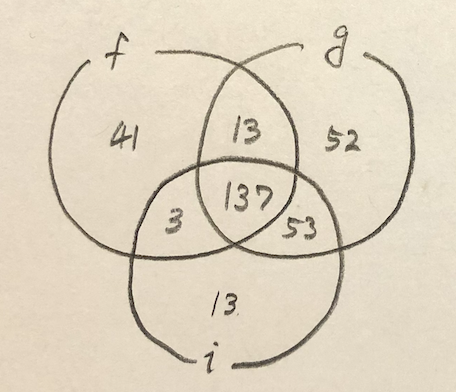
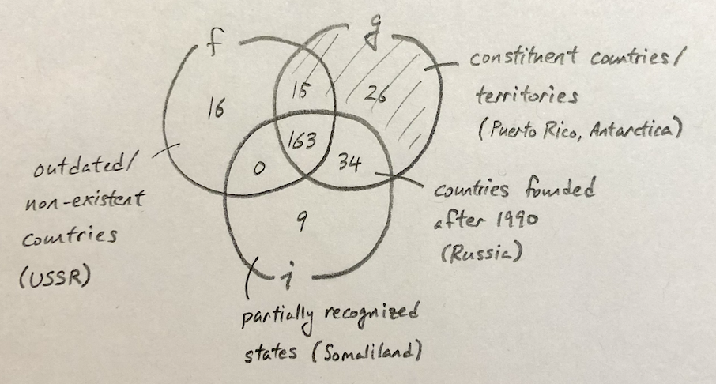

# Datasets

tldr: "countries" are hard to define

## Sources and Descriptions

- Flags: https://archive.ics.uci.edu/ml/datasets/Flags
  - Contains color information of each flag. This dataset is from 1990 so there is some outdated information, e.g. has USSR instead of Russia, Germany-DDR and Germany-FRG are listed separately. Also population/area/language/religion columns are unreliable.
- Geodata: https://github.com/datasets/geo-countries/blob/master/data/countries.geojson
  - Geojson polygon file of countries. Includes regions that are not countries, e.g. US Naval Base Guantanamo Bay and Cyprus No Mans Area. These regions have '-99' in their ISO_A3 columns.
- Flag Images: https://data.world/pbi/country-flag-database-from-wikipedia
  - Contains links to flag images of all sovereign states. Original source: https://en.wikipedia.org/wiki/Gallery_of_sovereign_state_flags

## Merging Datasets

run `merge_datasets.py` to get `merged_countries.geojson`

Initial data:

|            | flags | geodata | images  |
| ---------- | ----- | ------- | ------- |
| rows       | 194   | 255     | 206     |
| identifier | Name  | ADMIN   | Country |

1. Drop null ISO_A3 values from geodata, clean up country names

issues: 

- Flags dataset has outdated/missing info
  - in the process of filling in
- inconsistent names for one country
  - tried to fix manually as much as possible (step 1)
- flags have changed over the years (r.g. afghanistan used to have gold but not anymore, albania, romania, argentina)
  - there seems to be quite a bit of this, might be an issue
  - might be easier to fix once we have an interactive way to compare results and flag images

